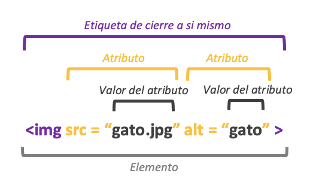

<h1 align="center">
   Clase 10 : Etiqueta Img  
   <!-- <a href="http://devchallenges.io" target="_blank">Devchallenges.io</a>. -->
</h1>

## Tabla de contenido

- [Etuiqeta Img](#etiqueta)
- [Links](#links)

## Etiqueta

[Etiqueta imagen](../HTML/claseImg/index.html)

## links

* [Developer mozilla](https://developer.mozilla.org/es/docs/Learn/HTML/Multimedia_and_embedding/Images_in_HTML)

---
 |  
[Clase 9: Optimización...](./Optimizaci%20f78f7.md)
 |  
...[Clase 11: Etiqueta figure](./Etiqueta%20f%2054736.md)
 |  
[Curso de Html5 & CSS3](../README.md)
 |  