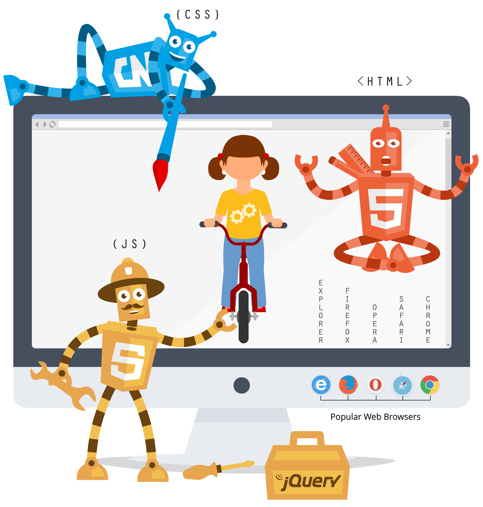

<h1 align="center">
    ¿Qué es el Frontend?
</h1>

## Tabla de contenido

- [¿Qué es el frontend?](#Frontend)
- [Estándares de un frontend](#Estándares)
- [Frameworks de css](#FrameworksCss)
- [frameworks de JS](#FrameworksJs)
- [Preprocesadores de CSS](#PreprocesadoresCss)
- [Compiladores / empaquetadores de JS:](#CompiladoresJs)

## Frontend

## **¿Qué es el frontend?** 

Un frontend está conectado con el cliente, desarrolla para el cliente.

El cliente es el navegador 

El **frontend** es la parte del desarrollo web que se dedica a la parte frontal de un sitio web, en pocas palabras del diseño de un sitio web, desde la estructura del sitio hasta los estilos como colores, fondos, tamaños hasta llegar a las animaciones y efectos.

## **Estándares de un frontend:** 

HTML5: 

CSS3:

JavaScript:

## **Frameworks de css:**  

- Bootstrap [https://getbootstrap.com/](https://getbootstrap.com/)
- Foundation CSS [https://get.foundation/](https://get.foundation/)
- Materialize CSS [https://materializecss.com/](https://materializecss.com/)

## **Los frameworks de JS:** 

- React JS [https://es.reactjs.org/](https://es.reactjs.org/)
- Angular JS [https://angular.io/](https://angular.io/)
- Vue JS [https://vuejs.org/](https://vuejs.org/)

## **Preprocesadores de CSS:** 

- stylus [https://stylus-lang.com/](https://stylus-lang.com/)
- SASS [https://sass-lang.com/](https://sass-lang.com/)

## **Compiladores / empaquetadores de JS:** 

- BABEL [https://babeljs.io/](https://babeljs.io/)
- Webpack [https://webpack.js.org/](https://webpack.js.org/)

---
 |  
[Clase 2: Backend](./Backend%20c33d1.md)
 |  
[Curso de Html5 & CSS3](../README.md)
 |  
