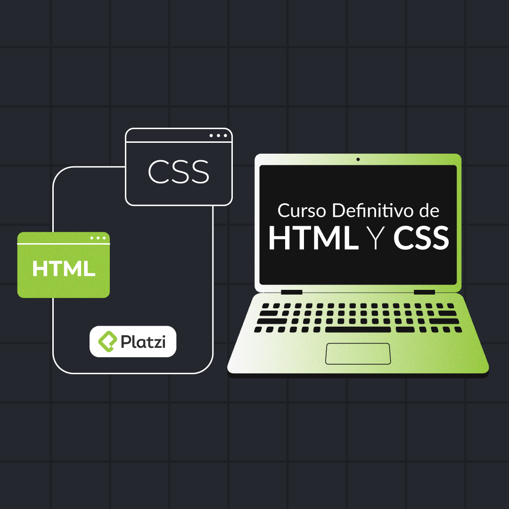

# Html & CSS definitivamente

## Table of content

### **Web Developer Fundamentals**

[Frontend](Md/Frontend%207fbab.md)

[Backend](Md/Backend%20c33d1.md)

[Fullstack](Md/Fullstack%20cb8a1.md)

[Páginas estáticas vs Dinámicas](Md/Paginas-estaticas-vs-dinamicas.md)

### Html

[Anatomía de una página web](Md/Anatomia-de-una-web.md)

[Index y estructura básica](Md/Index%20y%20es%20edb34.md)

[Anatomía de una etiqueta de HTML](Md/Anatomia-de-una-etiqueta-html.md)

### Etiquetas multimedia

[Tipos de imágenes ](Md/Tipos%20de%20i%20d07cb.md)

[Optimización de imágenes](Md/Optimizaci%20f78f7.md)

[Etiqueta img](Md/Etiqueta%20i%20c483c.md)

[Etiqueta figure](Md/Etiqueta%20f%2054736.md)

[Etiqueta video](Md/Etiqueta%20v%20c7340.md)

### **Formularios**

[****Etiqueta form e input****](Md/Etiqueta%20f%20893de.md)

[Calendar ](Md/Calendar%201b04c.md)

[Autocomplete y require ](Md/Autocomple%20f3c3c.md)

[Select](Md/Select%200537c.md)

[Input type submit vs Button tag](Md/Input%20type%2079422.md)

